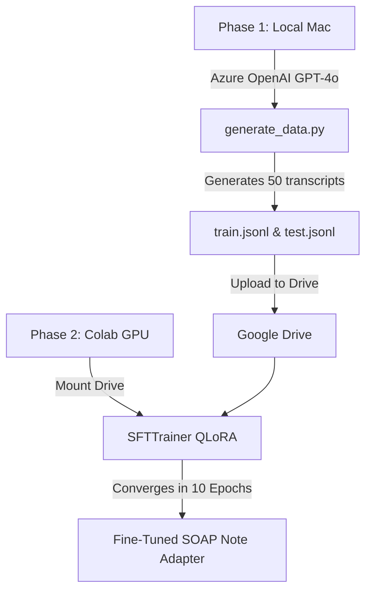

# MLE Interview Prep: LLaMA-2 & QLoRA Clinical SOAP Note Generator

This guide is designed for quick reading and recall right before your interview. It covers NLP concepts, our pipeline, hyperparameter rationales, and the engineering bugs we solved.

---

## 1. Core Concepts (Hugging Face, LLaMA, & TinyLlama)

### What is Hugging Face?
*   **Hugging Face (HF)** is the central hub/ecosystem for modern Open-Source AI.
*   **HF Hub**: The "GitHub for AI" where models, tokenizers, datasets, and adapters are stored and shared.
*   **HF Libraries**: We used:
    *   `transformers`: To load and run the model and tokenizer.
    *   `peft` (Parameter-Efficient Fine-Tuning): To apply QLoRA.
    *   `trl` (Transformer Reinforcement Learning): To run `SFTTrainer` (Supervised Fine-Tuning).
    *   `datasets`: To load and preprocess training data.

### What is LLaMA?
*   **LLaMA** (Large Language Model Meta AI) is Meta’s state-of-the-art open-weights model family. 
*   **LLaMA-2**: Pre-trained on 2 trillion tokens, with improved context length (4096 tokens) and Grouped-Query Attention (GQA).
*   **Chat Models**: Versions fine-tuned with RLHF (Reinforcement Learning from Human Feedback) to act as conversational assistants.

### What is TinyLlama?
*   **TinyLlama** is a compact, highly optimized 1.1B parameter model built on the LLaMA-2 architecture. 
*   **Why we chose it**: It is fully compatible with LLaMA-2's syntax but requires significantly less VRAM. This allowed us to run training and model merging on a standard, free Google Colab T4 GPU (15GB VRAM) without OOM crashes, while keeping generation speeds incredibly fast.

---

## 2. Quantization, PEFT, & QLoRA Explained

*   **PEFT (Parameter-Efficient Fine-Tuning)**: Instead of updating all billions of weights in a model (which is slow and requires massive GPU memory), PEFT freezes the base model and only trains a tiny set of helper weights (adapters). This saves VRAM and prevents "catastrophic forgetting."
*   **Quantization (4-bit/NF4)**: Reduces the precision of the model's weights from 16-bit floating points (`float16`) to 4-bit (`NormalFloat4`). This shrinks the model's memory footprint by ~75% (TinyLlama goes from ~4.4GB VRAM to ~1GB just to load).
*   **LoRA (Low-Rank Adaptation)**: Injects small, trainable rank-decomposition matrices (adapters) into the attention layers. During backpropagation, only these small adapter matrices are updated.
*   **QLoRA (Quantized LoRA)**: Combines 4-bit quantization with LoRA. We load the base model in 4-bit, keep it frozen, and train the active 16-bit LoRA adapters on top.

---

## 3. What We Built (Our Hybrid Pipeline)

### Why a Hybrid Pipeline?
*   **Colab Timeout Protection**: Generating synthetic datasets via API takes a long time. If Colab disconnected or idled during this phase, progress would be lost. Generating locally on your Mac bypassed this.
*   **API Key Security**: Kept your Azure OpenAI API keys safely on your local machine, avoiding putting them in a shared/public Colab notebook.
*   **GPU Quota Conservation**: Saved valuable Colab GPU compute hours for training, rather than wasting them on waiting for slow LLM API calls.

---

## 4. Hyperparameters We Tuned & Why (Interview Gold!)

Be ready to explain **exactly why** we set these numbers:

1.  **`num_train_epochs = 10` (Total Steps = 110)**:
    *   *Why*: At `epoch = 1` (6 steps), the model continued the doctor-patient dialogue instead of writing the SOAP note. In just 6 steps, a model cannot override its pre-trained chatty nature. Training for 10 epochs (110 steps) gave it enough weight updates to learn the strict SOAP format.
2.  **`max_length = 600` (Prompt Truncation) & `max_seq_length = 1024`**:
    *   *Why*: The raw datasets had transcripts of 4,000+ tokens. Because the training limit was `1024` tokens, the training sequence was being cut off mid-transcript. The model **never saw the target SOAP note response** during training! Truncating input transcripts to 600 tokens guaranteed that the entire prompt + target response fit inside `1024` tokens, allowing the model to learn the mapping.
3.  **`per_device_train_batch_size = 2` & `gradient_accumulation_steps = 2`**:
    *   *Why*: Creates an **effective batch size of 4** ($2 \times 2 = 4$). This balances stable gradient updates with the VRAM limits of the T4 GPU.
4.  **`learning_rate = 2e-4`**:
    *   *Why*: The standard, proven learning rate for LoRA adapters. Anything higher (e.g., `1e-3`) causes gradient explosion, and anything lower (e.g., `1e-5`) makes learning too slow.
5.  **`bf16 = True` & `fp16 = False`**:
    *   *Why*: The base TinyLlama model weights are stored in `BFloat16`. Training in `fp16` activates the PyTorch `GradScaler`, which crashes when it encounters `bf16` parameters. Switching to `bf16` training disabled the scaler and made precision consistent.
6.  **`lora_r = 64` & `lora_alpha = 16`**:
    *   *Why*: Set the rank of the adapter. A rank of 64 gives the adapter enough capacity to learn the complex, structural formatting required for medical SOAP notes.

---

## 5. Engineering Challenges We Solved (Proves Competence!)

If the interviewer asks: *"What was the hardest part of this task?"* talk about these bugs:

1.  **SFTTrainer Unexpected Keyword Arguments**:
    *   *What*: TRL (v0.8.0+) updated its API and deprecated passing parameters like `max_seq_length` or `dataset_text_field` to `SFTTrainer.__init__()`.
    *   *Solution*: Migrated to the modern `SFTConfig` helper class and passed it into the trainer's `args` parameter.
2.  **BFloat16 GradScaler Incompatibility**:
    *   *What*: Encountered a runtime crash: `_amp_foreach_non_finite_check_and_unscale_cuda not implemented for BFloat16`.
    *   *Solution*: Standardized the training configurations to run consistently in `BFloat16` (`bf16=True`, `fp16=False`, `bnb_4bit_compute_dtype='bfloat16'`), disabling the standard mixed-precision scaler.
3.  **Tokenizer Parameter Deprecation**:
    *   *What*: `tokenizer` parameter in `SFTTrainer` was deprecated.
    *   *Solution*: Aligned with the latest transformers API by passing it via `processing_class=tokenizer`.
4.  **Positional Embedding Overflow**:
    *   *What*: Generating on long transcripts (>2,048 tokens) caused the model's self-attention scores to break down, resulting in repetitive gibberish.
    *   *Solution*: Implemented token-level truncation capping inputs at 600 tokens before wrapping them in instruction templates.
